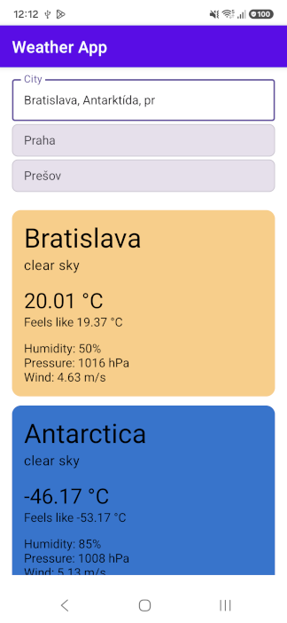

# Weather App

Android weather application implemented as part of the coding task.

## Screenshot

## Implemented

- Weather information for individual cities
- Search for multiple cities separated by commas
- Independent loading state for each city
- City autocomplete suggestions loaded from a local file
- Loading and error states

## Tech stack

- Kotlin
- Jetpack Compose
- Coroutines
- Retrofit
- OpenWeather API

